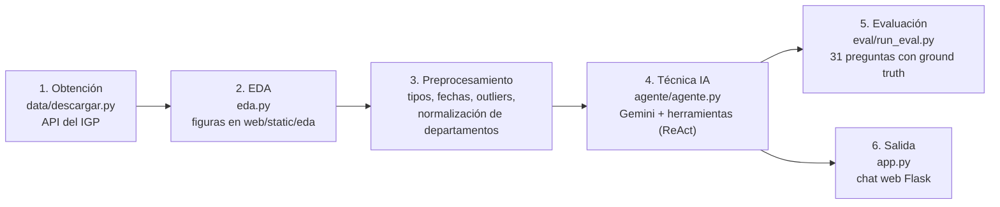

# 🌎 SismoAgente — Agente LLM analista de sismos del Perú

Proyecto final del curso de Inteligencia Artificial.
**Técnica de IA:** Agente (integración de LLM con herramientas / *function calling*, patrón ReAct).

Un agente conversacional que responde preguntas en lenguaje natural sobre el
catálogo de **sismos reportados por el Instituto Geofísico del Perú (IGP)**.
El agente (Gemini) decide en cada paso si responde o invoca una herramienta:
consultar el esquema, ejecutar una expresión de pandas sobre los datos, o
generar un gráfico. Toda cifra de sus respuestas proviene de los datos reales,
no de la memoria del modelo.

## 1. Problema

Los datos sísmicos del IGP son públicos, pero explorarlos exige saber
programar. Este agente permite que cualquier persona los consulte en español
("¿cuál fue el sismo más fuerte en Arequipa en 2025?") y obtenga cifras y
gráficos verificables al instante.

## 2. Datos

| | |
|---|---|
| **Fuente** | API pública del IGP — `https://ultimosismo.igp.gob.pe/api/ultimo-sismo/ajaxb/<año>` |
| **Contenido** | Sismos *reportados* (percibidos por la población) en el Perú |
| **Cobertura** | 2012 – presente (≈ 8,190 sismos al 2026-07-09) |
| **Variables** | 13 columnas: fecha/hora, latitud, longitud, profundidad (km), magnitud (M), referencia, departamento, intensidad, etc. |
| **Licencia** | Datos abiertos del Estado Peruano (IGP) |
| **Descarga** | `python data/descargar.py` regenera `data/sismos_igp.csv` |

## 3. Pipeline



1. **Obtención** (`data/descargar.py`): descarga año por año desde la API del IGP.
2. **EDA** (`eda.py`): estadísticas, distribuciones de magnitud/profundidad,
   sismos por año y departamento, mapa de epicentros, análisis de nulos.
3. **Preprocesamiento** (en `data/descargar.py`): combinación fecha+hora,
   conversión de tipos, filtrado de outliers de coordenadas (6 registros fuera
   del Perú), normalización del departamento contra la lista canónica de 25
   departamentos con emparejamiento aproximado (corrige typos como
   "Arequiupa", "Lima.", "Apurímac"/"Apurimac"), columnas derivadas
   (año, mes, hora, tipo de profundidad sismológica).
4. **Técnica de IA** (`agente/`): loop ReAct **manual** sobre la API de Gemini
   con *function calling* y 3 herramientas:
   - `obtener_esquema()` — columnas, tipos, rangos y ejemplos
   - `consultar_datos(expresion)` — expresión de pandas evaluada en un
     entorno restringido (solo lectura, sin builtins)
   - `graficar(...)` — genera un PNG que el chat muestra al usuario

   El loop es manual (no automático) para poder medir **pasos, llamadas a
   herramientas, errores y tiempo** por episodio, las métricas de agentes de
   la rúbrica.
5. **Evaluación** (`eval/`): 31 preguntas cuya respuesta correcta se calcula
   del propio CSV (`generar_preguntas.py`); `run_eval.py` corre los
   experimentos y produce tablas y gráficos comparativos.
6. **Salida** (`app.py`): aplicación web de chat (Flask) con selector de
   modelo, traza de herramientas visible y gráficos inline.

## 4. Experimentos (3, con ≥3 configuraciones cada uno)

| # | Pregunta | Configuraciones | Métricas |
|---|----------|-----------------|----------|
| 1 | ¿Qué modelo conviene? | `gemini-3.1-flash-lite` vs `gemini-3-flash-preview` vs `gemini-3.5-flash` | tasa de éxito, pasos, llamadas, tiempo |
| 2 | ¿Aportan las herramientas? | agente con herramientas vs LLM solo con resumen vs LLM solo sin resumen | tasa de éxito |
| 3 | ¿Importa el prompt de sistema? | detallado vs sin formato vs mínimo | tasa de éxito, llamadas, errores de herramienta |

```bash
python eval/run_eval.py --exp all          # los 3 experimentos completos
python eval/run_eval.py --exp exp1 --quick # prueba rápida (8 preguntas)
```

Resultados en `eval/resultados/`: `resumen_<exp>.csv` (tabla comparativa),
`grafico_<exp>.png` y un JSON detallado por configuración.

## 5. Instrucciones de ejecución

```bash
cd mlagente
python -m venv venv
venv\Scripts\activate            # Windows  (Linux/Mac: source venv/bin/activate)
pip install -r requirements.txt

# API key de Gemini (gratis en https://aistudio.google.com/apikey)
copy .env.example .env           # y colocar tu GEMINI_API_KEY

python data/descargar.py         # 1. obtener datos (o usar el CSV incluido)
python eda.py                    # 2. EDA (figuras en web/static/eda)
python -m agente.agente "¿Cuál fue el sismo de mayor magnitud en 2024?"   # smoke test
python app.py                    # 6. app web -> http://127.0.0.1:5000
```

Modelo por defecto: `gemini-3.1-flash-lite` (cambiable con la variable de
entorno `GEMINI_MODELO` o desde el selector de la interfaz).

## 6. Estructura

```
mlagente/
├── app.py                  # app web de chat (Flask)
├── agente/
│   ├── agente.py           # loop ReAct + métricas por episodio
│   ├── herramientas.py     # obtener_esquema / consultar_datos / graficar
│   └── prompts.py          # variantes de system prompt (experimento 3)
├── data/
│   ├── descargar.py        # obtención + preprocesamiento
│   └── sismos_igp.csv      # dataset limpio
├── eda.py                  # análisis exploratorio
├── eval/
│   ├── generar_preguntas.py
│   ├── preguntas.json      # 31 preguntas con ground truth
│   ├── run_eval.py         # experimentos 1-3
│   └── resultados/
└── web/                    # plantilla y estáticos del chat
```
